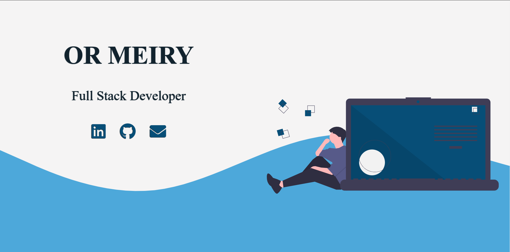

# My Portfolio Website

### what can you do?

Learn about me, see my projects in action and get into the code.

### For this project I used:

- React with hooks.
- useForm hook, toastify and Intersection Observer API.
- CSS Animations and Font Awesome.

I had so much fun working on this one. It was amazing from start to finish.
I will update it from time to time with new content and projects!.

[Check it out!][new portfolio]

[Old portfolio website repo ->][old portfolio]

[new portfolio]: https://ormeiry.github.io/Meiry-Portfolio/
[old portfolio]: https://github.com/ormeiry/OR-s-Portfolio
